# Coffee Shop App

A Flutter-based coffee shop application that allows users to search for coffee products and provides an admin interface to manage products. The app is equipped with a native splash screen and features full CRUD operations (Create, Read, Update, Delete) for managing the product catalog.

## Features

- **Native Splash Screen**: The app includes a customizable native splash screen that enhances user experience during startup.
- **Product Search**: Users can easily search for products from the main page using the search functionality.

- **Admin Panel**:
- **Add Products**: Admins can add new products with necessary details.
- **Edit Products**: Admins can modify existing product details.
- **Delete Products**: Admins can remove products from the catalog.
- **View Products**: Admins can view a complete list of all available products.

## State Management

- **Flutter Bloc**: The app uses Flutter Bloc for state management, ensuring efficient and scalable handling of UI states and business logic across different pages.

## Database Integration

- **SQL Helper**: The app integrates a local SQLite database using SQL Helper to store, manage, and retrieve product data.

## Admin Page

The admin page allows product management with user-friendly input forms and clear product lists. Admins can perform the following actions:

- **Add** new coffee products.
- **Update** details of existing products.
- **Delete** unwanted products from the list.
- **View** all coffee products with details.

## Screenshots

### Splash Screen

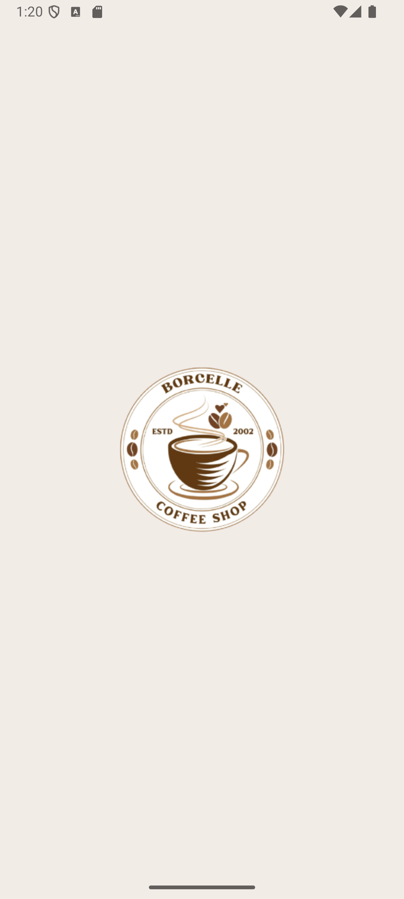

### Admin Panel

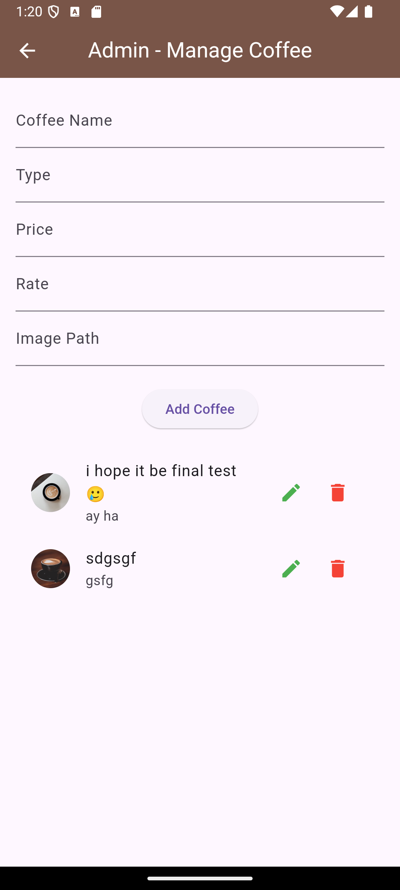

### Adding Item

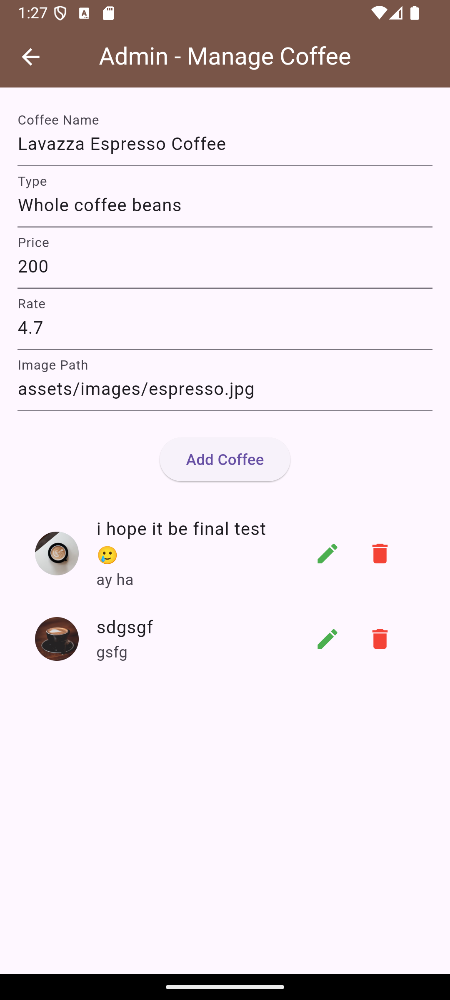

### Check Inputs

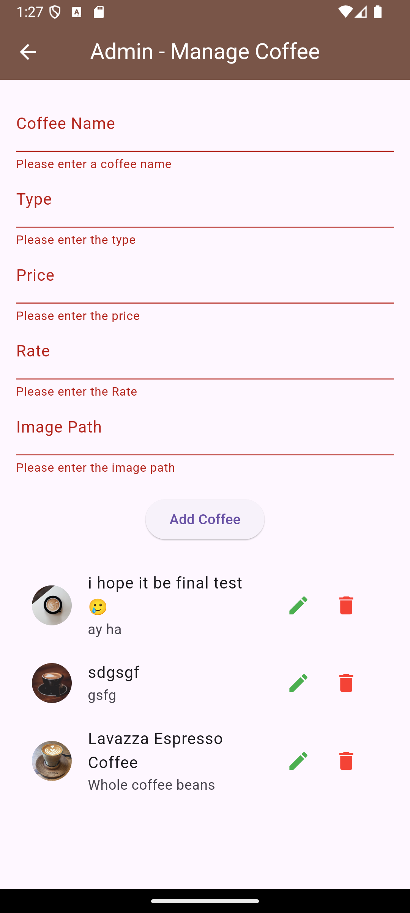

### Show Item if Added

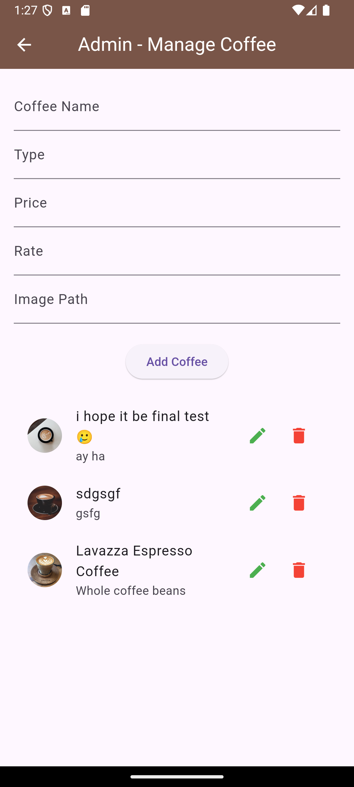

### Welcome Screen

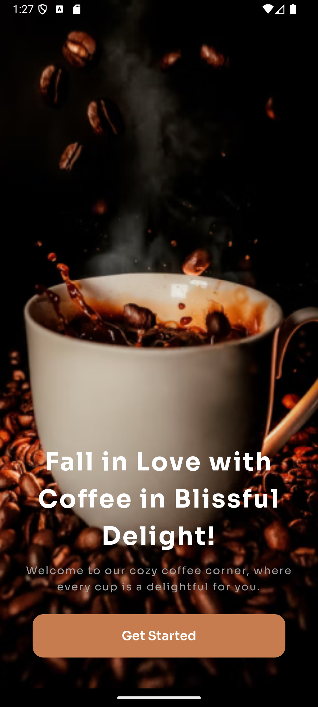

### Home Screen

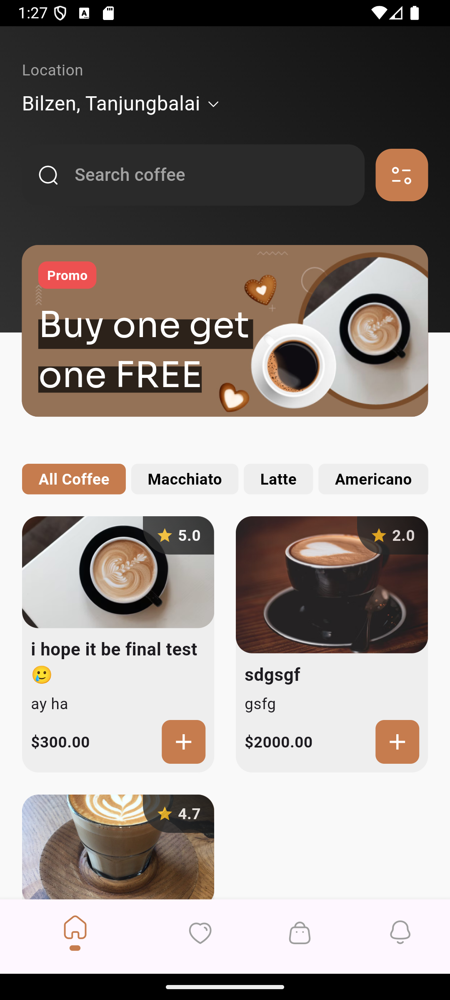

### Search Screen

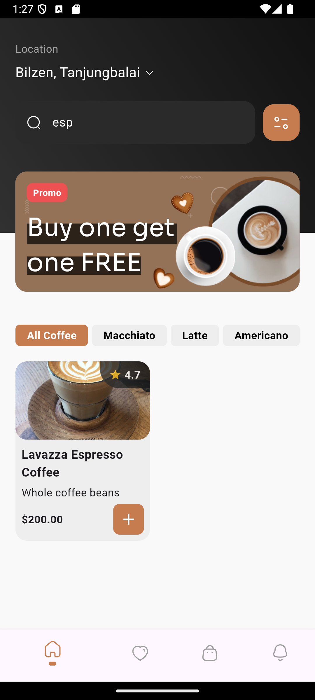

### Details Screen

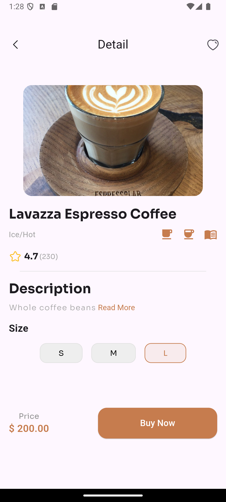

### Order Screen

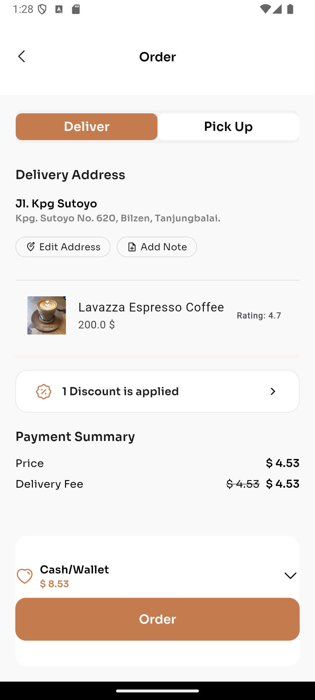

### Delivery Screen

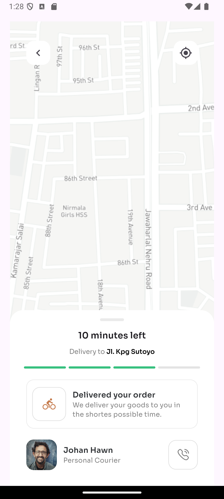

### Take Away Screen

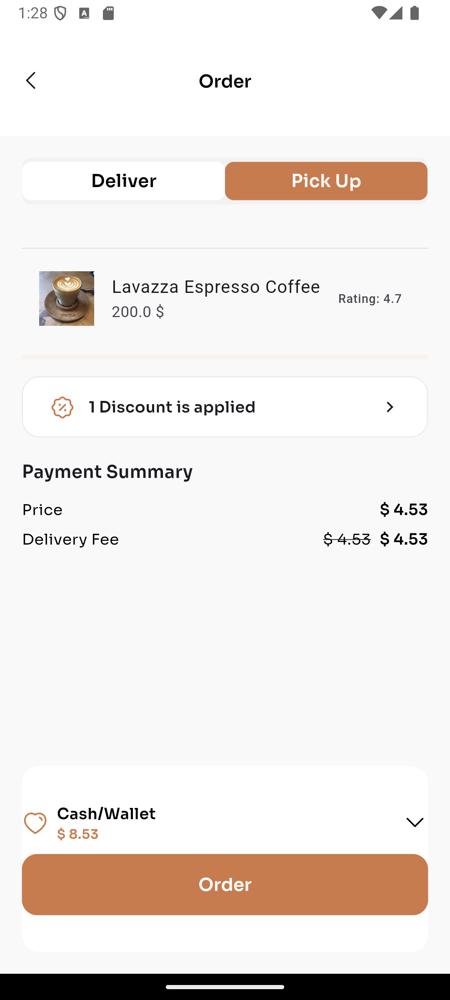

## Developer Information

- **Name**: Mohamed Ahmed Mohamed Abdelkawy
- **Role**: Flutter Developer
- **Email**: mohamedahbd545@gmail.com
- **Number**: +201060796400

## Getting Started

1. Clone the repository.
2. Install the dependencies using:

```bash
flutter pub get
```
